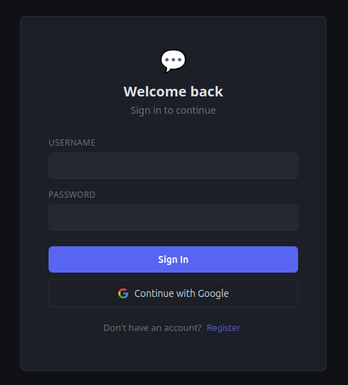
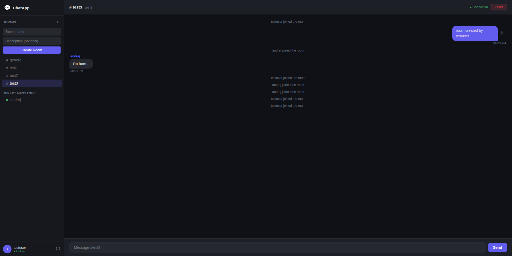
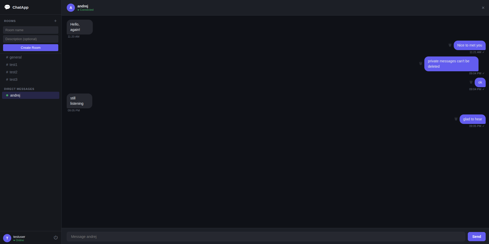
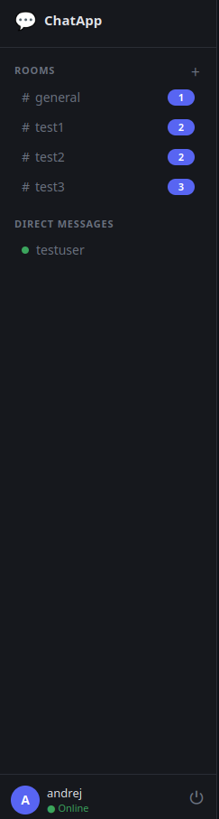

# ChatApp

A full-stack, real-time chat application built with Java Spring Boot, WebSocket (STOMP), Redis, PostgreSQL, and React. Features room-based group chat, private messaging, Google OAuth2 login, online presence tracking, typing indicators, and unread message badges.


---

## Screenshots

> Login screen — username/password and Google OAuth2



> Chat room — real-time messaging with typing indicator



> Private messaging — 1-on-1 direct messages with read receipts



> Sidebar — online presence, unread badges, room list



---

## Features

- **Real-time messaging** — WebSocket + STOMP, messages delivered instantly with no polling
- **Group chat rooms** — create, join, and leave public rooms
- **Private messaging** — 1-on-1 direct messages between users
- **Typing indicator** — see when someone is typing in real time
- **Online presence** — green/grey dot shows who is online
- **Unread message badges** — room sidebar shows unread count
- **Message deletion** — soft delete your own messages in rooms and private chats
- **Message history** — Redis cache for recent messages, PostgreSQL for full history
- **JWT authentication** — stateless token-based auth with BCrypt password hashing
- **Google OAuth2** — login with your Google account
- **Read receipts** — ✓ sent / ✓✓ read indicators on private messages
- **Role-based access** — ADMIN, CLIENT roles (extensible)
- **Dockerized** — full stack in Docker Compose with one command

---

## Architecture

```
React Frontend (localhost:3000)
        │
        ├── HTTP (REST)     → login, load rooms, load history
        └── WebSocket       → real-time messages, typing, presence
                │
        Spring Boot API (localhost:8080)
                │                    │                    │
                ├── PostgreSQL       ├── Redis            └── Google OAuth2
                │   full history     │   recent msgs           identity
                │   users, rooms     │   (last 50/room)
                │                   │
                └── In-memory presence & unread tracking
```

**Key architectural decision:** WebSocket connections are authenticated with JWT on the STOMP CONNECT frame — not HTTP sessions. The server maintains no session state; every request (HTTP or WebSocket) is validated via the JWT token.

---

## Tech Stack

| Layer | Technology |
|-------|-----------|
| Backend | Java 21, Spring Boot 4.0.3 |
| WebSocket | Spring WebSocket, STOMP protocol, SockJS |
| Security | Spring Security, JWT (jjwt 0.12.6), BCrypt, Google OAuth2 |
| Cache | Redis 7 (recent message cache, 24h TTL, last 50 messages per room) |
| Database | PostgreSQL 16 |
| ORM | Spring Data JPA, Hibernate 7 |
| Frontend | React 18, @stomp/stompjs, SockJS-client, Axios |
| Containerization | Docker, Docker Compose |
| Build | Maven (with Maven Wrapper) |

---

## Project Structure

```
chat-app/
├── src/main/java/com/andrej/chat_app/
│   ├── config/
│   │   ├── SecurityConfig.java         # Spring Security + CORS + OAuth2
│   │   ├── WebSocketConfig.java        # STOMP config + JWT auth interceptor
│   │   └── RedisConfig.java            # RedisTemplate configuration
│   ├── controller/
│   │   ├── AuthController.java         # POST /api/auth/register, /login
│   │   ├── ChatController.java         # WebSocket: send, join, typing, delete
│   │   ├── RoomController.java         # REST: rooms CRUD + messages + unread
│   │   ├── PrivateMessageController.java # REST: conversation history
│   │   └── UserController.java         # GET /api/users
│   ├── dto/
│   │   ├── MessageDto.java
│   │   ├── PrivateMessageDto.java
│   │   ├── RoomDto.java
│   │   ├── SendMessageRequest.java
│   │   ├── SendPrivateMessageRequest.java
│   │   ├── CreateRoomRequest.java
│   │   └── AuthResponse.java / LoginRequest / RegisterRequest
│   ├── model/
│   │   ├── Message.java                # messages table (CHAT, JOIN, LEAVE types)
│   │   ├── PrivateMessage.java         # private_messages table
│   │   ├── Room.java                   # rooms table
│   │   ├── RoomMember.java             # room_members table
│   │   ├── User.java                   # users table
│   │   └── Role.java                   # ADMIN | CLIENT enum
│   ├── repository/
│   │   ├── MessageRepository.java
│   │   ├── PrivateMessageRepository.java
│   │   ├── RoomRepository.java
│   │   ├── RoomMemberRepository.java
│   │   └── UserRepository.java
│   ├── security/
│   │   ├── JwtUtil.java                # generate + validate JWT tokens
│   │   ├── JwtFilter.java              # OncePerRequestFilter for HTTP
│   │   └── OAuth2SuccessHandler.java   # find/create user after Google login
│   ├── service/
│   │   ├── AuthService.java
│   │   ├── MessageCacheService.java    # Redis read/write for room messages
│   │   ├── OnlinePresenceService.java  # in-memory online user tracking
│   │   ├── UnreadCountService.java     # in-memory unread count tracking
│   │   ├── OAuth2UserService.java
│   │   └── UserDetailsServiceImpl.java
│   ├── listener/
│   │   └── WebSocketEventListener.java # detect connect/disconnect events
│   └── exception/
│       ├── GlobalExceptionHandler.java
│       ├── ResourceNotFoundException.java
│       ├── UserAlreadyExistsException.java
│       └── BadRequestException.java
├── frontend/src/
│   ├── App.js                          # routing, state, presence WebSocket
│   ├── constants/index.js              # API URL, WS URL, COLORS
│   └── components/
│       ├── Login.jsx                   # login + register + Google OAuth2 button
│       ├── Sidebar.jsx                 # rooms, DMs, online status, unread badges
│       ├── ChatRoom.jsx                # room chat, typing indicator, delete
│       └── PrivateChat.jsx             # 1-on-1 chat, read receipts, delete
├── Dockerfile                          # multi-stage build
├── docker-compose.yml                  # app + PostgreSQL + Redis
└── pom.xml
```

---

## Running Locally (IntelliJ + React)

### Prerequisites

- Java 21 (JDK)
- PostgreSQL 16
- Redis
- Node.js 18+
- IntelliJ IDEA (Community or Ultimate)
- A Google Cloud project with OAuth2 credentials

---

### Step 1 — PostgreSQL setup

```bash
sudo -u postgres psql
```

```sql
CREATE DATABASE chat_app;
CREATE USER andrej WITH PASSWORD 'YourPassword123!';
GRANT ALL PRIVILEGES ON DATABASE chat_app TO andrej;
GRANT ALL ON SCHEMA public TO andrej;
\q
```

---

### Step 2 — Redis setup

```bash
# Install
sudo apt install redis-server

# Start
sudo systemctl start redis-server

# Verify
redis-cli ping
# Expected: PONG
```

---

### Step 3 — Google OAuth2 credentials

1. Go to [console.cloud.google.com](https://console.cloud.google.com)
2. Create a new project (e.g. `chat-app`)
3. Navigate to **APIs & Services → OAuth consent screen**
   - Choose **External**
   - Fill in app name and your email
   - Add scopes: `email`, `profile`
4. Navigate to **APIs & Services → Credentials → Create OAuth Client ID**
   - Application type: **Web application**
   - Authorized redirect URI:
     ```
     http://localhost:8080/login/oauth2/code/google
     ```
5. Copy the **Client ID** and **Client Secret**

> ⚠️ Never commit credentials to a public repository.

---

### Step 4 — Configure application.properties

Open `src/main/resources/application.properties` and fill in your values:

```properties
spring.application.name=chat-app

# PostgreSQL
spring.datasource.url=jdbc:postgresql://localhost:5432/chat_app
spring.datasource.username=andrej
spring.datasource.password=YourPassword123!
spring.jpa.hibernate.ddl-auto=update
spring.jpa.show-sql=true
spring.jpa.open-in-view=false

# Redis
spring.data.redis.host=localhost
spring.data.redis.port=6379

# JWT
jwt.secret=your-secret-key-min-32-chars-long-here
jwt.expiration=86400000

# Google OAuth2
spring.security.oauth2.client.registration.google.client-id=YOUR_CLIENT_ID
spring.security.oauth2.client.registration.google.client-secret=YOUR_CLIENT_SECRET
spring.security.oauth2.client.registration.google.scope=email,profile
```

---

### Step 5 — Run the backend in IntelliJ

1. Open IntelliJ IDEA
2. Click **File → Open** → select the `chat-app` folder
3. Wait for Maven to download dependencies (bottom progress bar)
4. Open `src/main/java/com/andrej/chat_app/ChatAppApplication.java`
5. Click the green ▶ button next to the class
6. Wait for:
   ```
   Started ChatAppApplication in X seconds
   ```
7. Verify it's running:
   ```bash
   curl http://localhost:8080/api/auth/register \
     -H "Content-Type: application/json" \
     -d '{"username":"admin","email":"admin@chat.com","password":"Test1234!"}'
   ```
   Expected: `{"token":"...","username":"admin","role":"CLIENT"}`

---

### Step 6 — Run the frontend

```bash
cd frontend
npm install
npm start
```

Open [http://localhost:3000](http://localhost:3000)

---

### Step 7 — Register and log in

**Option A — username/password:**
- Click **Register** on the login screen
- Enter username and password
- You're logged in automatically

**Option B — Google OAuth2:**
- Click **Continue with Google**
- Approve the consent screen
- You're redirected back and logged in automatically

---

### Step 8 — Test real-time features

Open two browser tabs (or use incognito for the second):

1. Log in as different users in each tab
2. Create a room with the **+** button in the sidebar
3. Both users join the same room
4. Send messages — they appear instantly in both tabs
5. Start typing — the other user sees "X is typing..."
6. Click a username in **DIRECT MESSAGES** to open a private chat
7. Send private messages — only visible to the two participants

---

## API Reference

### Authentication (public)

| Method | Endpoint | Body | Description |
|--------|----------|------|-------------|
| `POST` | `/api/auth/register` | `{username, email, password}` | Register a new user |
| `POST` | `/api/auth/login` | `{username, password}` | Login — returns JWT |
| `GET` | `/oauth2/authorization/google` | — | Start Google OAuth2 flow |

### Rooms (authenticated)

| Method | Endpoint | Description |
|--------|----------|-------------|
| `GET` | `/api/rooms` | List all public rooms |
| `POST` | `/api/rooms` | Create a new room |
| `POST` | `/api/rooms/{id}/join` | Join a room |
| `DELETE` | `/api/rooms/{id}/leave` | Leave a room |
| `GET` | `/api/rooms/{id}/messages` | Get last 50 messages (Redis → PostgreSQL) |
| `GET` | `/api/rooms/{id}/online` | Get online users in room |
| `GET` | `/api/rooms/unread` | Get unread counts per room |
| `POST` | `/api/rooms/{id}/read` | Mark room as read |

### Private Messages (authenticated)

| Method | Endpoint | Description |
|--------|----------|-------------|
| `GET` | `/api/messages/private/{username}` | Get conversation history |
| `GET` | `/api/users` | List all users (for DM sidebar) |

### WebSocket Destinations (STOMP)

Send to these destinations after connecting to `ws://localhost:8080/ws`:

| Destination | Payload | Description |
|-------------|---------|-------------|
| `/app/chat.send` | `{roomId, content}` | Send message to room |
| `/app/chat.join` | `{roomId}` | Announce join |
| `/app/chat.typing` | `{roomId}` | Broadcast typing event |
| `/app/chat.delete` | `{messageId, roomId}` | Delete room message |
| `/app/chat.private` | `{content, receiverUsername}` | Send private message |
| `/app/private.delete` | `{messageId, otherUsername}` | Delete private message |

Subscribe to these topics to receive events:

| Topic | Description |
|-------|-------------|
| `/topic/room.{id}` | Room messages |
| `/topic/room.{id}.typing` | Typing events |
| `/topic/room.{id}.delete` | Delete events |
| `/topic/presence` | Online users list |
| `/user/queue/private` | Your private messages |
| `/user/queue/private.delete` | Your private message deletions |
| `/user/queue/unread` | Your unread count updates |

---

## Database Schema

```sql
CREATE TABLE users (
    id          BIGSERIAL PRIMARY KEY,
    username    VARCHAR UNIQUE NOT NULL,
    email       VARCHAR UNIQUE NOT NULL,
    password    VARCHAR NOT NULL,        -- BCrypt or 'OAUTH2_USER'
    role        VARCHAR,                 -- ADMIN | CLIENT
    created_at  TIMESTAMP,
    last_login  TIMESTAMP,
    active      BOOLEAN DEFAULT true
);

CREATE TABLE rooms (
    id          BIGSERIAL PRIMARY KEY,
    name        VARCHAR UNIQUE NOT NULL,
    description VARCHAR,
    created_by  VARCHAR,
    created_at  TIMESTAMP,
    is_private  BOOLEAN DEFAULT false
);

CREATE TABLE room_members (
    id          BIGSERIAL PRIMARY KEY,
    room_id     BIGINT,
    username    VARCHAR,
    joined_at   TIMESTAMP
);

CREATE TABLE messages (
    id               BIGSERIAL PRIMARY KEY,
    content          VARCHAR NOT NULL,
    sender_username  VARCHAR,
    room_id          BIGINT,
    sent_at          TIMESTAMP,
    deleted          BOOLEAN DEFAULT false,
    type             VARCHAR             -- CHAT | JOIN | LEAVE
);

CREATE TABLE private_messages (
    id                BIGSERIAL PRIMARY KEY,
    content           VARCHAR NOT NULL,
    sender_username   VARCHAR,
    receiver_username VARCHAR,
    sent_at           TIMESTAMP,
    read              BOOLEAN DEFAULT false,
    deleted           BOOLEAN DEFAULT false
);
```

---

## Running with Docker

```bash
# Set your Google credentials as environment variables
export GOOGLE_CLIENT_ID=your_client_id
export GOOGLE_CLIENT_SECRET=your_client_secret

# Build and start
docker compose up --build -d
```

Services:
- API: `http://localhost:8081`
- PostgreSQL: `localhost:5434`
- Redis: `localhost:6380`

Update `frontend/src/constants/index.js` to use port 8081 when running Docker:

```js
export const API = 'http://localhost:8081/api';
export const WS_URL = 'http://localhost:8081/ws';
```

Stop all containers:
```bash
docker compose down
```

---

## How WebSocket Authentication Works

Standard HTTP auth (cookie/session) doesn't work well with WebSocket. Here's what we do instead:

1. User logs in via `POST /api/auth/login` → receives JWT token
2. React stores the token in `localStorage`
3. When connecting to WebSocket, the token is passed in the STOMP CONNECT frame header:
   ```javascript
   connectHeaders: { Authorization: `Bearer ${token}` }
   ```
4. `WebSocketConfig.java` intercepts the CONNECT frame via a `ChannelInterceptor`
5. Validates the JWT, extracts username and role
6. Sets the authenticated `Principal` on the WebSocket session
7. All subsequent `@MessageMapping` methods receive the correct `principal.getName()`

This means **no HTTP session is needed** — the WebSocket connection is stateless and JWT-secured.

---

## What I Learned

- **WebSocket vs HTTP** — persistent bidirectional connections vs request/response
- **STOMP protocol** — topics, queues, pub/sub messaging pattern over WebSocket
- **WebSocket JWT auth** — intercepting STOMP CONNECT frames with a ChannelInterceptor
- **Redis as a cache** — TTL expiry, list operations, cache-aside pattern
- **Online presence** — tracking connect/disconnect via Spring WebSocket events
- **Soft deletes** — marking records as deleted instead of removing them from the DB
- **User-specific destinations** — `/user/queue/*` routes messages to specific users only
- **Real-time notifications** — unread counts pushed via WebSocket instead of polling

---

## Author

**Andrej Trožić**
- GitHub: [@AT95BL](https://github.com/AT95BL)
- LinkedIn: [Andrej Trožić](https://linkedin.com/in/andrej-trožić)
- Portfolio: [at95-portfolio.com](https://at95-portfolio.com)

---

## License

MIT License — feel free to use this project as a reference or starting point.
